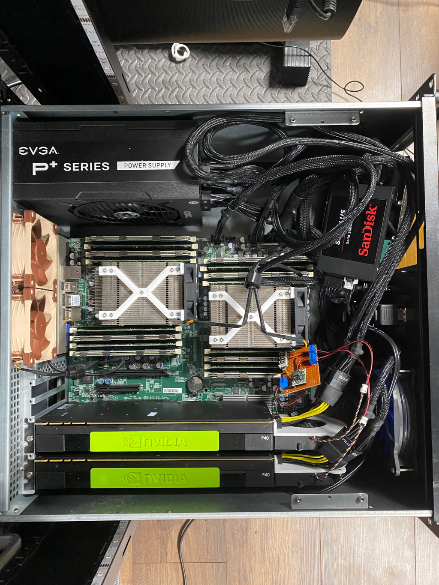

### ✨ About me

Hi, I'm Mindaugas, aka *mindow*. I'm a Full Stack Data Scientist,
with 10+ years of experience using
predictive analytics, data engineering and software development
to do all kinds of *funky* stuff. I enjoy building things all the way
from an abstract idea, to something you can touch
(inasmuch as you can touch digital products).

Currently working as a senior data scientist at a consulting firm in [Nuremberg, Germany](https://www.google.com/maps/place/Nuremberg/).

### 🛠️ Tech stack

As a Data Scientist, I primarily work with `Python` and `SQL`. For projects that require a reactive frontend, [like in this one](https://github.com/vaitekunas/reviewer), I use `Vue.js`. When I'm building less *data-sciency* applications, I often turn to `Java`. And for side projects, I usually reach for `Rust`.

### 🌟 Hobbies

There is a [saying](https://www.goodreads.com/quotes/1798-you-are-the-average-of-the-five-people-you-spend): you are the average of the five people you spend the most time with. Well, when it comes to hobbies, this can be translated to:
                
> Your hobbies correspond to the five [subreddits](https://en.wikipedia.org/wiki/Reddit#Subreddits) you frequent the most.

That being said, I spend a lot of my free time tinkering with my homelab, 3D-printing (and 3D-cleaning-up), building and clacking mechanical keyboards, ricing my linux machines in accordance to the latest trends in *unixporn*, and letting the magic smoke out in my experiments with electronics.

||||
|------------|--------------------|-------------|
| Having a bunch of servers, a NAS, networking gear and raw *aesthetics* is cool. Paying 0.4€/kWh in Germany is less so. | Poor man's deep learning rig:   > Mom, can we have some LLMs?   > We have LLMs at home!   > \*LLMs at home\* | How many keyboards does a person really need? The number you're thinking right now is really an order of magnitude lower than it should be. Once you go *clack*, you can never go back. | 

### 🔗 Get in touch

* Personal site: [vaitekunas.com](https://vaitekunas.com)
* LinkedIn: [LinkedIn](https://www.linkedin.com/in/vaitekunas/)
